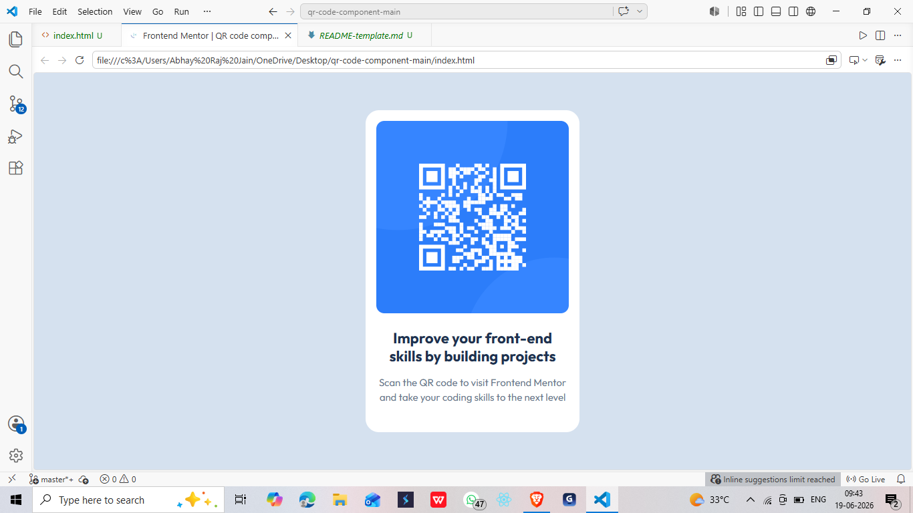

# Frontend Mentor - QR code component solution

This is a solution to the [QR code component challenge on Frontend Mentor](https://www.frontendmentor.io/challenges/qr-code-component-iux_sIO_H).

## Table of contents

- [Overview](#overview)
  - [Screenshot](#screenshot)
  - [Links](#links)
- [My process](#my-process)
  - [Built with](#built-with)
  - [What I learned](#what-i-learned)
  - [Continued development](#continued-development)
- [Author](#author)

## Overview

### Screenshot



### Links

- Solution URL: [solution URL](https://your-solution-url.com)
- Live Site URL: [Live URL]([https://death8959.github.io/](https://death8959.github.io/QR-code-component/))

## My process

### Built with

- Semantic HTML5 markup
- CSS custom properties
- CSS Grid
- Mobile-first workflow

### What I learned

Learned to avoid hardcoding heights on containers — letting padding drive the size keeps the layout flexible. Also practiced keeping text wrapping in CSS instead of using `<br>` tags in HTML.

```css
.container {
  padding: 16px 16px 40px;
  /* no fixed height — content drives the size */
}
```

### Continued development

Want to keep practicing pixel-perfect layouts and get more comfortable with spacing systems and typography matching from a design file.

## Author

- Frontend Mentor - [@Death8959](https://www.frontendmentor.io/profile/Death8959)
